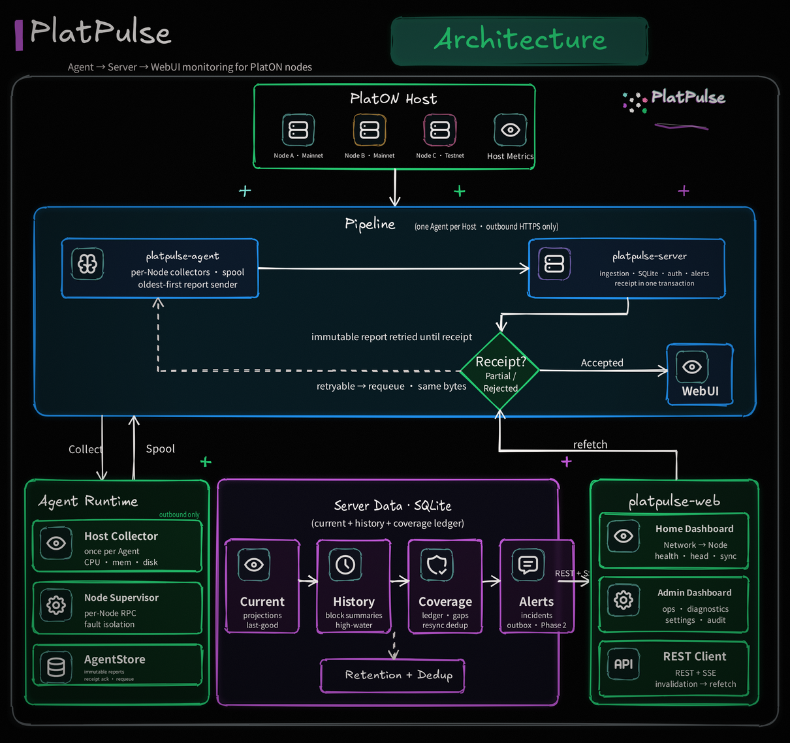

<div align="center">
  
  <p><strong>A Server–Agent–WebUI monitoring suite for PlatON nodes.</strong></p>
  <p>
    Real-time health metrics · Block &amp; transaction insight · Consensus status · Peer insights · Validator analytics · Alerts
  </p>
</div>

# PlatPulse

PlatPulse is an open-source monitoring suite that makes PlatON node operations observable, actionable, and easy to scale. Lightweight Agents collect node and chain observations, a central Server ingests and validates them, and a WebUI presents current health and operational insights.

> **Status:** Target architecture confirmed in [`docs/design/platpulse.md`](docs/design/platpulse.md). Phase 0 is underway: the Rust workspace (`platpulse-core`, `platpulse-agent`, `platpulse-server`) and `platpulse-web` skeleton build with CI quality gates; `platpulse-core` carries the frozen AgentReport v1 wire contract (envelope, Observation Envelope, Node Inventory, Host/Node observations, Block Summary, History Gap, Report Receipt, rejection codes) with canonical/historical JSON fixtures; and Agent/Server each have an independent SQLx SQLite migration and startup-integrity harness. No monitoring product exists yet — collection, Server ingestion, and UI features arrive in the remaining Phase 0 and Phase 1 tickets. Domain terminology is defined in [`CONTEXT.md`](CONTEXT.md).

## Why PlatPulse

Operating blockchain infrastructure requires more than a single process health check. PlatPulse brings the operational picture together in one place:

- **Node health** — per-Node process, RPC, synchronization, and observation freshness
- **Block & transaction insight** — per-Node Head Subscription, Block Summaries, and transaction counts
- **Consensus visibility** — consensus current state and chain progress
- **Peer insights** — per-Node peer connectivity and peer state *(Phase 3)*
- **Validator analytics** — validator-oriented metrics and operational signals *(Phase 4)*
- **Alerts** — actionable conditions with durable notification delivery *(Phase 2)*

## Architecture

PlatPulse is a greenfield Server–Agent–WebUI architecture. One Agent runs on each Host and monitors the PlatON Nodes on that Host; the Server is the single collection point and trust boundary; the WebUI is served same-origin by the Server.

<p align="center">
  
</p>

### Core invariants

- **One Agent per Host; observations scoped per Node** — an Agent may monitor several Nodes, but block, transaction, consensus, peer, and error state are never merged into an Agent-level chain view. One Node has exactly one RPC Endpoint (`ipc://`, `ws://`, `wss://`); endpoint failover is not supported.
- **Host observation collected once per Agent** — shared CPU/memory/disk metrics are stored once and referenced by Node views, never duplicated per Node.
- **Last-good semantics** — a collection failure updates status and error but never overwrites the last successful value; unknown, stale, or never-observed state is never shown as `0`, `false`, or Healthy.
- **Immutable AgentReport + transactional receipt** — reports are persisted before sending and deleted only after the Server applies the receipt in one transaction; retries reuse identical bytes and `report_id`.
- **Append-only block history** — a plain resync replay never rewrites Block Summaries or re-accumulates counts below the historical high-water mark; only an explicit open gap permits backfill.
- **Server is the trust boundary** — every Agent-reported field is revalidated server-side; Agents connect outbound only, and the Server never pushes RPC endpoints, commands, or upgrades.
- **Separate Home and Admin contracts** — Public Projection is not a runtime-filtered Admin DTO; visibility filtering happens in the Server query layer.

### Workspace layout

```text
Cargo.toml
crates/
├── platpulse-core/     # AgentReport v1, wire types, Observation Envelope, Block Summary, History Gap
├── platpulse-agent/    # config/CLI, collectors, Node Supervisor, AgentStore, report sender
└── platpulse-server/   # HTTP/SSE, auth, Report Ingestion, SQLite projections, alerts, web assets
platpulse-web/          # React SPA; generated API client lives in src/api/generated/
```

### Workspace components

| Component | Responsibility |
| --- | --- |
| `platpulse-core` | I/O-free shared crate: AgentReport v1, wire identity, Observation Envelope, Block Summary, History Gap, receipt/error codes, and wire validation |
| `platpulse-agent` | Runs on a Host near its PlatON Nodes: config/CLI, Enrollment/Recovery, Host/Process/RPC collectors, per-Node Supervisor, Report assembler, AgentStore (durable spool), and sender |
| `platpulse-server` | Ingests reports, maintains SQLite current projections and history, validates Network identity, evaluates alerts, and exposes REST/SSE plus static Web assets |
| `platpulse-web` | TypeScript/React SPA: read-only Home Dashboard (Network → Node) and authenticated Admin Dashboard; responsive on desktop, tablet, and mobile |

## Tech stack

- **Rust workspace (Agent + Server):** Tokio, Axum + Tower, Reqwest (Rustls), Serde, SQLx SQLite, Alloy (Agent only), sysinfo, Clap + TOML, tracing, utoipa, Argon2id, time
- **Node.js (WebUI):** React, TypeScript strict, Vite, React Router, TanStack Query, native EventSource and fetch
- No ORM, gRPC, Kafka, NATS, Redis, workflow engine, or global DI container; dependencies are injected through explicit constructors.

## Deployment at a glance

- Linux-first (x86_64 / aarch64), single-tenant, single `platpulse-server`, SQLite (WAL).
- Agents and Server communicate over outbound HTTPS only; the Server never connects back to Agents.
- The WebUI is served same-origin by the Server in production — no Node.js runtime required.
- The Agent's Node Inventory (declared in local TOML) is authoritative for connection configuration; the Server never pushes endpoints.

## Roadmap

Each phase is independently deployable; no empty abstractions or schemas are added for future phases.

- [ ] **Phase 0 — Workspace & protocol foundation:** workspace, AgentReport v1, Observation Envelope, wire fixtures, migrations, OpenAPI/Web skeleton, CI
- [ ] **Phase 1 — First vertical slice:** one Agent monitoring multiple Nodes, Enrollment, per-Node Head Subscription + Block Resolution, AgentStore/spool, Report Ingestion/Receipt, minimal Network Registry, SQLite projections, Owner/Viewer login, private-by-default Home, Admin diagnostics, responsive WebUI
- [ ] **Phase 2 — Operations loop:** Recovery/rotation, Node lifecycle/Transfer, multi-user sessions, Audit, Alerts + Telegram outbox, Silence/Maintenance, retention aggregates, backup/restore/doctor
- [ ] **Phase 3 — Peer & Geo:** typed Peer Snapshots, presence intervals, operator-provided GeoLite2 country lookups, raw-IP privacy controls
- [ ] **Phase 4 — Validator analytics:** Validator Provider seam, Explorer adapter, Node Validator Links, ranking/reward metrics and aggregates
- [ ] **Phase 5 — Hardening:** native TLS, internal metrics, packaging, load/fault/soak testing, security review

## Non-goals

PlatPulse explicitly does **not** include: a TUI, Agent endpoint failover, remote control (no Server-pushed endpoints, commands, restarts, or upgrades), full transaction body/receipt/trace indexing, a block explorer or archive database, multi-tenant/HA/PostgreSQL clustering, SSO/OIDC/TOTP, or Windows/macOS Agent support.

## Project principles

- **Greenfield boundaries:** PlatPulse does not inherit the ChainDash architecture, TUI, or endpoint failover.
- **Operational correctness:** freshness, last-good values, durable delivery, and alert reliability are first-class concerns.
- **Per-Node ownership:** a failure on one Node never stops its siblings' collection, reporting, or projection updates.
- **Server-side enforcement:** all security and sanitization boundaries are enforced by the Server, not the frontend.
- **Mobile-first WebUI:** Home and Admin must work on desktop, tablet, and mobile from Phase 1.
- **Incremental delivery:** the first milestone is a small end-to-end vertical slice, followed by deeper collectors and richer views.
- **Clear contracts:** shared behavior belongs in explicit, versioned protocol and domain types.

## Development

The Phase 0 baseline ships with quality gates for both halves of the workspace:

```bash
# Rust (Agent/Server)
cargo fmt --check
cargo clippy --all-targets --all-features -- -D warnings
cargo test --workspace

# Web (platpulse-web)
npm install
npm run lint
npm run typecheck
npm test
npm run build
```

CI (`.github/workflows/ci.yml`) runs the same gates on every push to `main` and on every pull request. Later phases extend it with `cargo deny`/`cargo audit`, OpenAPI regeneration checks, and Playwright projects once the corresponding tickets land.

The three Rust crates keep thin binaries (`src/main.rs`) and testable libraries. The Agent and Server now include only the SQLx SQLite startup/migration dependencies required by their storage boundary; the remaining framework stack arrives with the tickets that first need it.

## Documentation

- [`docs/design/platpulse.md`](docs/design/platpulse.md) — design authority: architecture, invariants, protocol, phases, and acceptance criteria
- [`CONTEXT.md`](CONTEXT.md) — domain terminology and banned synonyms

## Contributing

The project is in its foundation phase. Design discussions, issues, and focused pull requests are welcome as the workspace and protocol take shape.

Before publishing integrations or packages under the `PlatPulse` name, perform an independent trademark, domain, GitHub, and package-name availability check.

## License

PlatPulse is licensed under the [MIT License](LICENSE).
