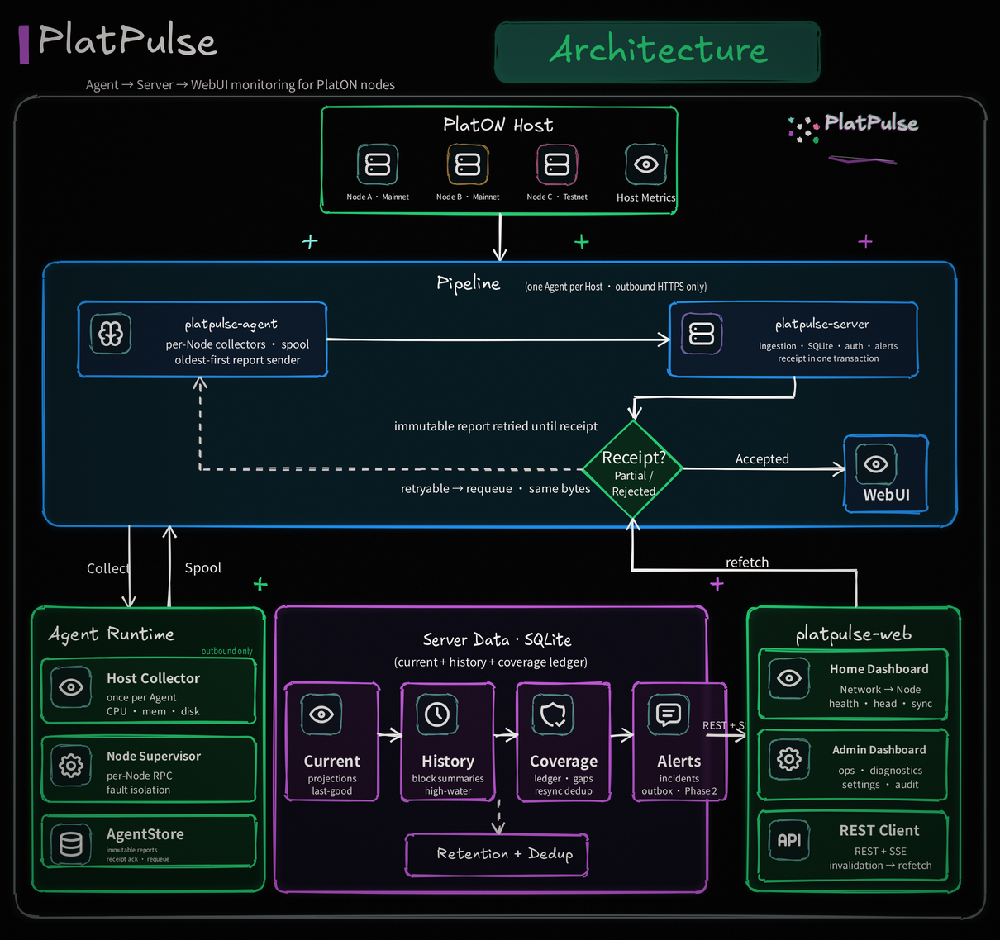

<div align="center">
  
  <p><strong>A Server–Agent–WebUI monitoring suite for PlatON nodes.</strong></p>
  <p>
    Real-time health metrics · Block &amp; transaction insight · Consensus status · Peer insights · Validator analytics · Alerts
  </p>
</div>

# PlatPulse

PlatPulse is an open-source monitoring suite that makes PlatON node operations observable, actionable, and easy to scale. Lightweight Agents collect node and chain observations, a central Server ingests and validates them, and a WebUI presents current health and operational insights.

> **Status:** The Agent → Server → WebUI monitoring path is implemented and packaged. An Agent enrolls with a single-use token, collects Host, Process, RPC, chain, Peer, and Validator observations for every Node on its Host, durably spools immutable AgentReports, and retries them byte-for-byte; the Server revalidates every report and maintains SQLite current projections, bounded Block History, and the operational extensions. The WebUI registers its Home and Admin pages and is served same-origin by the Server. The pinned v1 wire contract remains supported; the Server-managed Inventory Revision (v2) path ships with an offline baseline conversion and a coordinated cutover. Remaining management-target work is tracked in GitHub Issues. [`docs/design/platpulse.md`](docs/design/platpulse.md) is the design authority and records the exact implemented-vs-accepted boundary; [`CONTEXT.md`](CONTEXT.md) defines the domain vocabulary.

## Why PlatPulse

Operating blockchain infrastructure requires more than a single process health check. PlatPulse brings the operational picture together in one place:

- **Node health** — per-Node process, RPC, synchronization, and observation freshness
- **Block &amp; transaction insight** — per-Node Head Subscription, Block Summaries, and transaction counts
- **Consensus visibility** — consensus current state and chain progress
- **Peer insights** — per-Node peer connectivity, presence intervals, and public country distribution
- **Validator analytics** — Validator Registry/Links, a PlatScan-backed Provider, and ranking/reward metrics and aggregates
- **Alerts** — typed rules, incidents, silences, and maintenance windows with at-least-once notification delivery

## Architecture

PlatPulse is a Server–Agent–WebUI architecture. One Agent runs on each Host and monitors the PlatON Nodes on that Host; the Server is the single collection point and trust boundary; the WebUI is served same-origin by the Server.

<p align="center">
  
</p>

### Core invariants

- **One Agent per Host; observations scoped per Node** — an Agent may monitor several Nodes, but block, transaction, consensus, peer, and error state are never merged into an Agent-level chain view. One Node has exactly one RPC Endpoint (`ipc://`, `ws://`, `wss://`); endpoint failover is not supported.
- **Host observation collected once per Agent** — shared CPU/memory/disk metrics are stored once and referenced by Node views, never duplicated per Node.
- **Last-good semantics** — a collection failure updates status and error but never overwrites the last successful value; unknown, stale, or never-observed state is never shown as `0`, `false`, or Healthy.
- **Immutable AgentReport + transactional receipt** — reports are persisted before sending and deleted only after the Server applies the receipt in one transaction; retries reuse identical bytes and `report_id`.
- **Append-only block history** — a plain resync replay never rewrites Block Summaries or re-accumulates counts below the historical high-water mark; only an explicit open gap permits backfill.
- **Server is the trust boundary** — every Agent-reported field is revalidated server-side; Agents connect outbound only, and the Server never pushes RPC endpoints, commands, or upgrades.
- **Separate Home and Admin contracts** — Public Projection is not a runtime-filtered Admin DTO; visibility filtering happens in the Server query layer.
- **Aggregate Peer/Geo data only** — Public and Admin surfaces expose redacted country counts and aggregates, never raw Peer addresses or identity lists.

### Workspace layout

```text
Cargo.toml
crates/
├── platpulse-core/     # AgentReport v1/v2, wire types, Observation Envelope, Block Summary, History Gap
├── platpulse-agent/    # config/CLI, collectors, Node Supervisor, AgentStore, report sender
└── platpulse-server/   # HTTP/SSE, auth, Report Ingestion, SQLite projections, alerts, web assets
platpulse-web/          # React SPA; generated API client lives in src/api/generated/
docs/                   # design authority, ADRs, OpenAPI, deployment, security, qualification
scripts/                # release, packaging, qualification, and local-deploy helpers
release/                # systemd units, Compose, OCI context, qualification profiles
```

### Workspace components

| Component | Responsibility |
| --- | --- |
| `platpulse-core` | I/O-free shared crate: AgentReport v1/v2, wire identity, Observation Envelope, Block Summary, History Gap, receipt/error codes, and wire validation |
| `platpulse-agent` | Runs on a Host near its PlatON Nodes: config/CLI, Enrollment/Recovery/Rotation, Host/Process/RPC collectors, per-Node Supervisor, Peer Snapshot collection, Report assembler, AgentStore (durable spool), and sender |
| `platpulse-server` | Ingests reports, maintains SQLite current projections and bounded history, validates Network identity, resolves Peer Geo, evaluates alerts and delivers notifications, serves REST/SSE plus static Web assets, and exposes an optional Prometheus metrics listener |
| `platpulse-web` | TypeScript/React SPA: read-only Home Dashboard (Network → Node → Node Detail) and authenticated Admin Dashboard; responsive on desktop, tablet, and mobile |

## Implemented surfaces

### Home (read-only)

- `/` — Active Node dashboard with Network filters, compact summary cards, and the public Peer country map (offline Natural Earth geometry served same-origin; no runtime CDN or tile service)
- `/nodes/:nodeId` — unified Node Detail: shared Header, six KPIs plus map, Chain state / Process / Host resources, conditionally a compact Validator performance card, and six live charts
- Anonymous reading is gated by the site-level Site Access Mode (`Private` by default; `Public` allows the permitted anonymous GET/SSE paths). Viewer sessions can read Home even in Private mode.

### Admin (Owner-only)

- `/admin` — Overview with the attention queue and operational summary
- `/admin/agents`, `/admin/agents/enroll`, `/admin/agents/:agentId` — Agent inventory, onboarding, identity, credential status, and diagnostics
- `/admin/nodes`, `/admin/nodes/:nodeId` — Node list and the diagnostic subset of the Admin Node Detail
- `/admin/networks`, `/admin/networks/:networkKey` — Network Registry metadata and identity/mismatch diagnostics
- `/admin/settings` — global Block History window, Site Access Mode, and Geo provider (`Disabled` / `Local MMDB` / `IPinfo` / `GeoJS`)
- `/admin/access/sessions`, `/admin/access/audit` — session review/revoke and immutable redacted audit
- Unknown paths under `/admin` render the registered Admin fallback, not a legacy page.

### Server/API and Agent extensions

The Server/Admin API additionally exposes People, Validator management/links/analytics, Alerts (rules, incidents, silences, maintenance), Notifications, Operations, Retention, Backups, Restore, Doctor, Node Transfer, and Agent recovery/credential rotation/revocation/removal. Some of these are DTO/operation surfaces without a dedicated SPA page; availability of an API does not imply a registered page. The Agent adds Enrollment, Recovery, Rotation/Revocation, boot/shutdown lifecycle reporting, spool policy/diagnostics, block resolution, Peer Snapshots, time exchange, and declaration-backed coordinated v1→v2 Inventory cutover.

## Tech stack

- **Rust workspace (Agent + Server):** Tokio, Axum + Tower, Reqwest (Rustls), Serde, SQLx SQLite, Alloy (Agent only; pinned fork), sysinfo, Clap + TOML, tracing, utoipa, Argon2id, time
- **Node.js (WebUI):** React 19, TypeScript strict, Vite, React Router, TanStack Query, Tailwind CSS, Radix primitives, Apache ECharts, native EventSource and fetch
- **Testing and tooling:** Vitest + Testing Library, Playwright (fixed viewport projects), `@hey-api/openapi-ts`-generated client, cargo-deny + cargo-audit
- No ORM, gRPC, Kafka, NATS, Redis, workflow engine, or global DI container; dependencies are injected through explicit constructors.

## Deployment at a glance

- Linux-first (x86_64 / aarch64), single-tenant, single `platpulse-server`, SQLite (WAL). In non-development mode the Server holds the database exclusively, so CLI backup/restore runs only while the Server is stopped.
- Agents and Server communicate over outbound HTTPS only; the Server never connects back to Agents.
- The WebUI is served same-origin by the Server in production — no Node.js runtime required.
- The Agent's Node Inventory is authoritative for connection configuration; the Server never pushes endpoints.
- Supports native Rustls TLS or an explicitly trusted HTTPS reverse proxy, an optional Prometheus metrics listener, systemd units, OCI/Compose deployment, and offline backup/restore/doctor commands.

## Roadmap

Each phase is independently deployable; no empty abstractions or schemas are added for future phases. Phases 0–5 have delivered their core scope, and the remaining management-target work is tracked in GitHub Issues.

- [x] **Phase 0 — Workspace & protocol foundation:** workspace, AgentReport v1, Observation Envelope, wire fixtures, migrations, OpenAPI/Web skeleton, CI
- [x] **Phase 1 — First vertical slice:** one Agent monitoring multiple Nodes, Enrollment, per-Node Head Subscription + Block Resolution, AgentStore/spool, Report Ingestion/Receipt, minimal Network Registry, SQLite projections, Owner/Viewer login, private-by-default Home, Admin diagnostics, responsive WebUI
- [x] **Phase 2 — Operations loop:** Recovery/rotation, Node lifecycle/Transfer, multi-user sessions, Audit, Alerts + Telegram notification delivery, Silence/Maintenance, retention aggregates, backup/restore/doctor
- [x] **Phase 3 — Peer & Geo:** typed Peer Snapshots, presence intervals, Owner-selected Geo provider (`Disabled` / `Local MMDB` / `IPinfo` / `GeoJS`), bounded background country resolution with a provider-keyed last-good cache, and aggregate-only raw-IP privacy controls
- [x] **Phase 4 — Validator analytics:** Validator Provider seam, PlatScan adapter, Node Validator Links, ranking/reward metrics and aggregates
- [x] **Phase 5 — Hardening:** native TLS, internal metrics, packaging, load/fault/soak testing, security review
- [ ] **Management target:** the accepted Agent/Node management surface and Server-managed Inventory Revision evolution are partially implemented; the exact remaining items are tracked in GitHub Issues and described in the design doc.

## Non-goals

PlatPulse explicitly does **not** include: a TUI, Agent endpoint failover, remote control (no Server-pushed endpoints, commands, restarts, or upgrades), full transaction body/receipt/trace indexing, a block explorer or archive database, multi-tenant/HA/PostgreSQL clustering, SSO/OIDC/TOTP/WebAuthn, or Windows/macOS Agent support.

## Project principles

- **Greenfield boundaries:** PlatPulse does not inherit the ChainDash architecture, TUI, or endpoint failover.
- **Operational correctness:** freshness, last-good values, durable delivery, and alert reliability are first-class concerns.
- **Per-Node ownership:** a failure on one Node never stops its siblings' collection, reporting, or projection updates.
- **Server-side enforcement:** all security and sanitization boundaries are enforced by the Server, not the frontend.
- **Mobile-first WebUI:** Home and Admin must work on desktop, tablet, and mobile.
- **Incremental delivery:** the first milestone is a small end-to-end vertical slice, followed by deeper collectors and richer views.
- **Clear contracts:** shared behavior belongs in explicit, versioned protocol and domain types.

## Development

Quality gates for both halves of the workspace:

```bash
# Rust (Agent/Server)
cargo fmt --check
cargo clippy --all-targets --all-features -- -D warnings
cargo test --workspace
cargo deny check && cargo audit --ignore RUSTSEC-2023-0071 --ignore RUSTSEC-2026-0253

# Web (platpulse-web)
cd platpulse-web
npm ci
npm run lint && npm run typecheck && npm test && npm run build
npm run test:e2e   # fixed Playwright projects against a temporary dev-mode Server
```

The e2e suite (`npm run test:e2e`) boots a fresh temporary SQLite Server around the production WebUI build, provisions an Owner and Viewer through the password-from-stdin CLI, seeds independent Nodes, and runs the fixed Playwright projects: `phone-360-touch`, `phone-390-touch`, `tablet-768-touch`, `desktop-1280`, and `desktop-1440` (the Emerald visual-migration acceptance matrix). The state directory is temporary and its seed data is only for the local test process; it is not a production bootstrap path.

Generated artifacts are committed and CI verifies they are fresh:

```bash
# Full OpenAPI 3 spec (the checked-in reference is docs/openapi/openapi.json)
cargo run -p platpulse-server --quiet -- --print-openapi > docs/openapi/openapi.json

# Browser TypeScript client (drops agent operations; written to src/api/generated/)
cd platpulse-web && npm run generate:api

# Offline world country geometry for the Home Peer country map (pinned Natural Earth
# 1:110m Admin 0 Countries, public domain); network is needed only for that download.
cd platpulse-web && node scripts/build-world-geometry.mjs
```

Packaging and qualification helpers:

```bash
# Build a target-aware release set (archives, packages when available, checksums, SPDX SBOM)
scripts/build-release.sh --target x86_64-unknown-linux-gnu --output target/release-artifacts

scripts/release-candidate-harness.sh        # packaged Server through CLI/HTTP/SSE boundaries
scripts/release-recovery-rehearsal.sh       # schema checkpoints, migration, backup/restore
scripts/final-release-qualification.sh \
  --profile release/qualification/ci.toml --allow-known-not-run --require-all

scripts/deploy-local.sh                     # local dev: rebuild and restart user-level services
```

CI lives in `.github/workflows/`: `ci.yml` runs the Rust and WebUI gates, release packaging, the e2e matrix, and the release-candidate harness; `qualification.yml` and `release.yml` run the resilience/profile gates and publish native artifacts. See [`docs/release-qualification.md`](docs/release-qualification.md) and [`docs/security-review.md`](docs/security-review.md).

## Server setup and login

Production packaging and the single-process Server/WebUI layout are documented in [`docs/deployment.md`](docs/deployment.md); a copyable config is [`crates/platpulse-server/server.example.toml`](crates/platpulse-server/server.example.toml). The release bundle installs WebUI assets at `/usr/share/platpulse/web` by default, so `web_root` is optional.

```bash
# 1. Create the state directory, SQLite schema, and pepper file
platpulse-server init --config /etc/platpulse/server.toml

# 2. Create the first Owner; the password is read from the TTY (hidden) or
#    from stdin — never from argv, and there is no default password
platpulse-server owner create --config /etc/platpulse/server.toml --username admin

# 3. Optionally create a Viewer, who can read Home but never Admin
platpulse-server viewer create --config /etc/platpulse/server.toml --username viewer

# 4. Serve the API and WebUI (loopback-only until TLS/trusted-proxy config
#    exists; explicit --dev uses a separate development cookie)
platpulse-server serve --config /etc/platpulse/server.toml
```

Until an Owner exists, `/health/live` succeeds while `/health/ready` reports `setup_required`, and no Agent Enrollment is allowed. Home and Admin are private by default: unauthenticated visitors are guided to the login page, and Site Access Mode (Owner-configured under `/admin/settings`) is the single switch that opens read-only Home to anonymous guests.

Offline operations run while the Server is stopped:

```bash
platpulse-server backup --config /etc/platpulse/server.toml
platpulse-server verify-integrity --config /etc/platpulse/server.toml
platpulse-server restore --config /etc/platpulse/server.toml --artifact-id <id> --yes
```

## Network registration and Agent Enrollment

Networks are registered by the Owner/operator on the Server — never auto-created from Agent input. The command requires the complete identity tuple and writes the Registry row plus an audit event in one transaction:

```bash
platpulse-server network create \
  --config /etc/platpulse/server.toml \
  --key platon-mainnet \
  --display-name "PlatON Mainnet" \
  --genesis-hash 0x0000000000000000000000000000000000000000000000000000000000000001 \
  --chain-id 210425 \
  --p2p-network-id 1 \
  --address-hrp lat
```

Enrollment is one-time per Agent: the operator creates a short-lived, single-use Enrollment Token (printed exactly once), and the new Agent presents it over the Agent API in exchange for its stable Agent ID, Agent Epoch, and a 256-bit Agent Credential. The Server stores only pepper-keyed digests; the Agent stores the credential in its own 0600 file, separate from `agent.toml`:

```bash
# On the Server host — prints a single-use pp_enroll_… token
platpulse-server agent create-enrollment-token --config /etc/platpulse/server.toml

# On the Agent host — paste the token at the hidden prompt
cat > /var/lib/platpulse-agent/agent.toml <<'EOF'
server_url = "https://monitor.example.com"
credential_file = "/var/lib/platpulse-agent/credential"
state_db = "/var/lib/platpulse-agent/agent.db"
EOF
platpulse-agent enroll --config /var/lib/platpulse-agent/agent.toml
```

The Enrollment Token cannot submit Agent Reports or reach human-facing APIs; the Agent Credential can only reach Agent routes; Human Sessions can neither enroll nor report. A repeated, expired, or already-consumed token is rejected and never creates a second Agent identity. Recovery re-issues the credential on the same Agent identity and advances the Agent Epoch; Rotation issues a new credential (optionally with a short overlap); Revoke invalidates a specific credential immediately.

## Documentation

- [`docs/design/platpulse.md`](docs/design/platpulse.md) — design authority: architecture, invariants, protocol, phases, and acceptance criteria
- [`docs/design/webui.md`](docs/design/webui.md) — WebUI page/route contracts and the routed-surface matrix
- [`CONTEXT.md`](CONTEXT.md) — domain terminology and banned synonyms
- [`docs/adr/`](docs/adr/) — architecture decision records (Agent Store receipt lifecycle, Emerald visual authority, Admin workspace, Owner removal/Node purge, automatic Validator identity, Home Node Card, Server-managed Inventory Revision, offline backup, receipt body slimming, Home list-selection geo aggregate)
- [`docs/deployment.md`](docs/deployment.md) — release bundles, installation, and the single-process layout
- [`docs/release-qualification.md`](docs/release-qualification.md) — resilience, recovery rehearsal, and final qualification
- [`docs/security-review.md`](docs/security-review.md) — Phase 5 security matrix and residual risks
- [`docs/openapi/openapi.json`](docs/openapi/openapi.json) — generated OpenAPI 3.1 reference

## Contributing

The project is under active development. Design discussions, issues, and focused pull requests are welcome. Before publishing integrations or packages under the `PlatPulse` name, perform an independent trademark, domain, GitHub, and package-name availability check.

## License

PlatPulse is licensed under the [MIT License](LICENSE).
