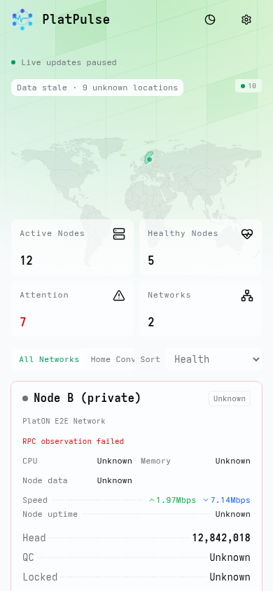
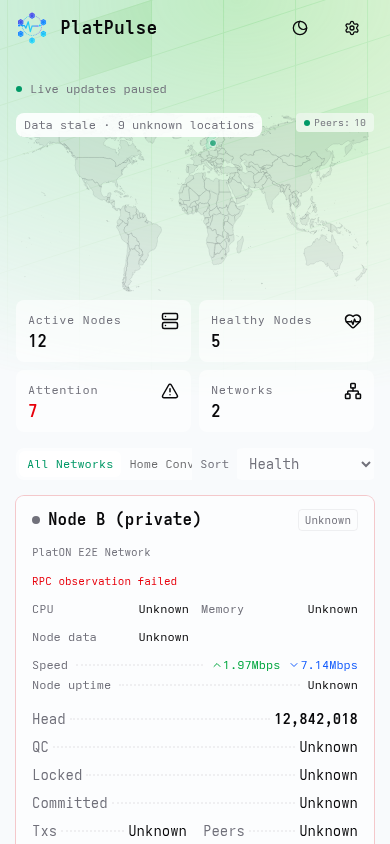
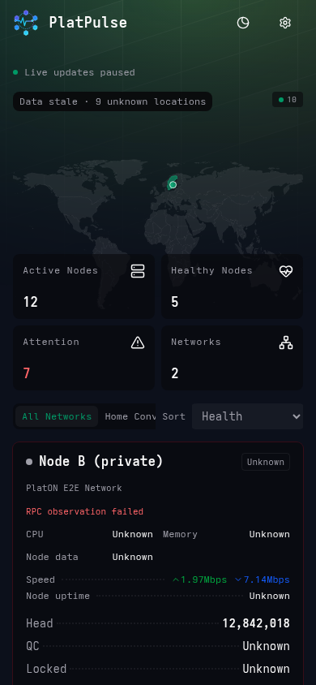
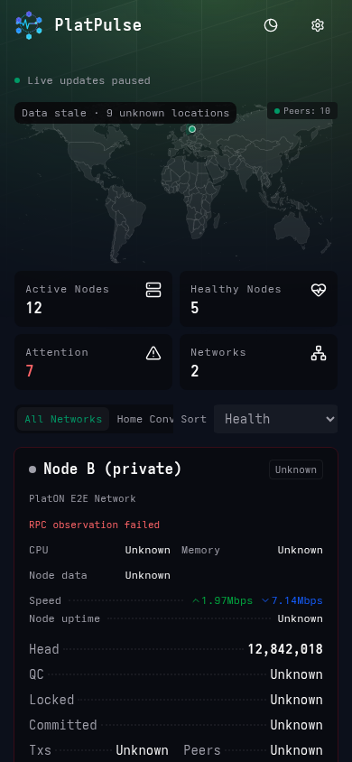
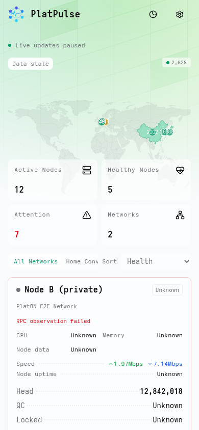
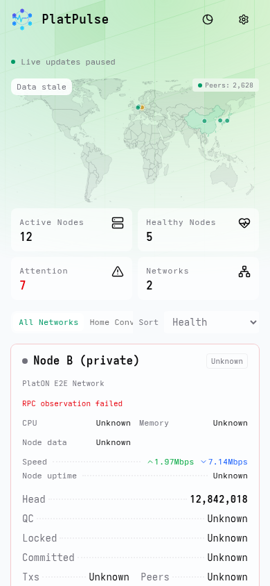
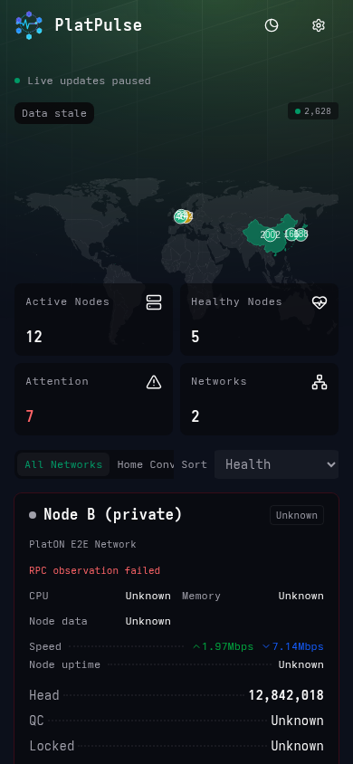
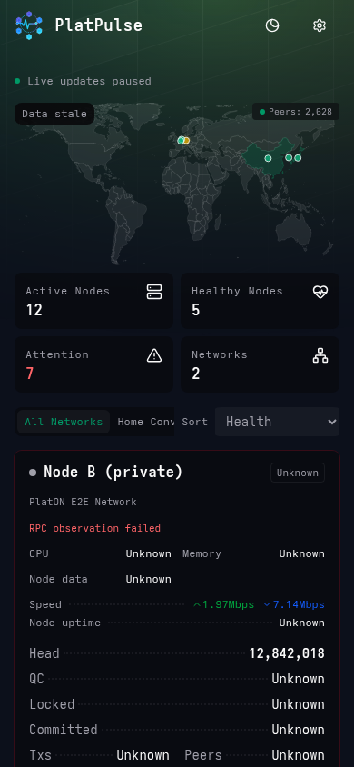

# Home 地图移动端精修：对照与验收

## 对照条件

- 修改前基线：`27aa6b9c423100627519d1156eb7b96ffcc5e7d5`。
- 修改后：本变更中的 `HomeDashboard.tsx`、`GeoWorldMap.tsx`、`mapChartOption.ts`；源码 SHA-256 见 `source-sha256.txt`。代码、测试、截图、固定数据随同一变更交付。
- Chromium 151 / Playwright 1.62.1，触摸上下文，`prefers-reduced-motion: reduce`；通过真实测试 Server 提供生产构建，不是组件示意图。
- `networks.json` 是测试 Server 的真实 Public DTO 快照（测试节点，不含生产观测）。前后均以这一个文件响应 Public Networks 请求，并阻止 SSE 后续更新，保证数据完全相同。其 SHA-256：`202bfd3c846ff26075fe3efbb42e037a88dc2ce31211cfbc50d746fe57d699cf`。
- 真实快照包含未知位置和过期状态，只有瑞典有可绘制点，因此另提供 **dense UI fixture**：明确为测试覆盖而构造的欧洲/东亚密集国家聚合数据，不声称来自真实 Peer 观测。前后由同一个脚本生成，国家代表点完全相同，德国含 stale 记录。
- 截图是实际浏览器原图，未裁切、拼接或后期修饰。`before/after-*-metrics.json` 保存 DOM 实测值。

## 390px 对照

| 场景 | 修改前 | 修改后 |
| --- | --- | --- |
| 固定真实 DTO · 浅色 |  |  |
| 固定真实 DTO · 深色 |  |  |
| 密集 UI fixture · 浅色 |  |  |
| 密集 UI fixture · 深色 |  |  |

完整原图覆盖 `320 / 360 / 390 / 430 / 844 / 1440`，每个宽度均有浅色、深色的前后图。844×390 是横屏，沿用 md 桌面构图，不将其强行改为手机竖向堆叠。

## 实测结果

| 竖屏宽度 | 修改前绘图区高度 | 修改前统计区相对地图底部 | 修改后绘图区高度 | 修改后间距 | 页面横向溢出（明/暗） |
| --- | ---: | ---: | ---: | ---: | --- |
| 320 | 352px | −152px（叠放） | 144px | 8px | 无 / 无 |
| 360 | 352px | −152px（叠放） | 164px | 8px | 无 / 无 |
| 390 | 352px | −152px（叠放） | 179px | 8px | 无 / 无 |
| 430 | 352px | −152px（叠放） | 199px | 8px | 无 / 无 |

320px 采用同一 2:1 比例自然降至 144px，没有为凑高度引入空白；360–430px 落在要求的约 160–200px 范围。统计卡为两列两行，和地图等宽对齐，8px 间距，未修改节点卡片排版。

**桌面像素回归**：1440×900 的真实固定 DTO 整页截图，ImageMagick `compare -metric AE`：浅色 **0**、深色 **0** 个差异像素。844px 横屏几何尺寸也与修改前相同。

### 实际执行

| 检查 | 结果 |
| --- | --- |
| `npm run lint` | 通过 |
| `npm run typecheck` | 通过 |
| `npm test` | 26 文件、304 测试通过 |
| `npm run build` | 通过；保留现有 ECharts 大 chunk 警告 |
| `mobile-map-responsive.spec.ts --project=phone-390-touch` | 1 通过（测试内部遍历全部手机宽度和明暗主题） |
| `home-geo-map.spec.ts --grep 'dense Europe'`（360 / 390 / 1440） | 3 通过 |

新浏览器验收实际执行了：

- 320/360/390/430px、明暗主题的布局、2×2 统计卡、等宽对齐及无横向溢出断言。
- 从真实 Canvas 像素中选取中国散点、国家填色区并分别点按：两者均显示 `1001 records`，提示不越屏；点绘图区空白关闭。
- 844×390 → 390×844 → 700×320 → 320×700 切换，画布 DOM 始终是同一个实例的画布。
- 从地图内部开始的 CDP 纵向触摸滑动，页面 `scrollY > 0`，不拦截纵向滚动。
- 网络筛选前后地图文档位置和尺寸不变、画布不重建。
- stale / unknown（从未观测）/ empty：保留可见状态；stale 的精确数量同时保留在读屏列表。
- 原有密集欧洲/东亚测试继续验证各国精确计数、无代表点国家的可访问说明、旗帜提示及筛选/resize 后数据不丢失。

单元测试另使用真实 ECharts 和原装世界几何（SVG SSR，共用 Canvas 的布局引擎），在 288×144、328×164、358×179、398×199 等绘图区检查 **所有几何顶点均在绘图区内**、geo/map 像素坐标一致，以及 resize 后仍一致。Option 测试验证移动端固定 7px、无常驻数量标签、scalar/tuple 两类提示完全一致、stale 精确值、未匹配国家不伪造 0；生命周期测试验证断点更新 option、ResizeObserver、无重复 init 及释放监听器。

**范围说明**：本次不是整仓库 Playwright 全量运行，也没有在实体 iOS/Android 或 Safari 上实测。物理设备触摸和 Safari 仍建议发布前抽查；上述结果来自 Chromium 触摸模拟，不将其描述为真机结果。

## 复现

在仓库根目录启动 `bash platpulse-web/e2e/start-server.sh`，另一个终端：

```sh
cd platpulse-web
node scripts/mobile-map-evidence.mjs after
node scripts/mobile-map-evidence.mjs after --dense
npx playwright test e2e/mobile-map-responsive.spec.ts --project=phone-390-touch
npx playwright test e2e/home-geo-map.spec.ts --grep 'dense Europe' \
  --project=phone-360-touch --project=phone-390-touch --project=desktop-1440
```

基线图使用基线代码构建后运行相同脚本，将 `after` 参数改为 `before`，并保留相同的 `networks.json`。测试 Server 在启动时读取首页 HTML，切换构建后必须重启 Server，避免缓存 HTML 引用上一构建的已删除资源。截图脚本只会在固定 DTO 文件不存在时从 Server 获取它；已有文件不会被覆盖。
